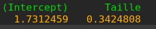
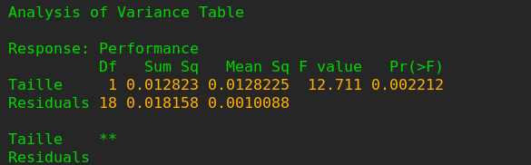
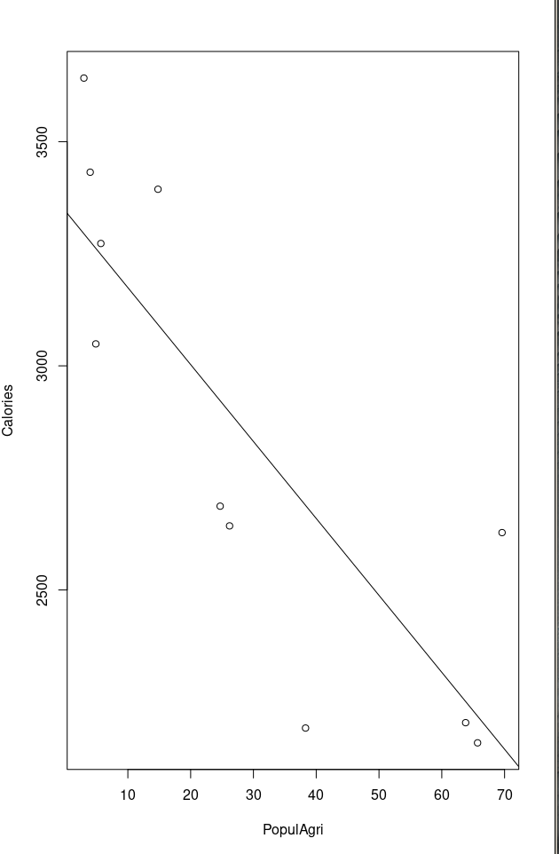
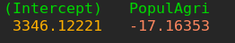
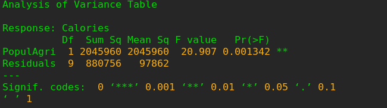
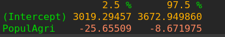
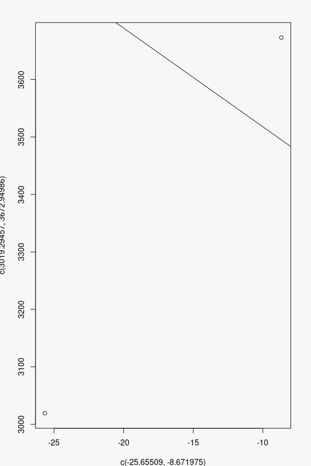

TD2 Exercise 6 et Exercise 7

Ex6. 
1. 
$Performance = β_0 + β_1 * Taille$ 

Coefficient 
$β_0 = 1.7312459 $
$β_1 = 0.342$

2. 

| Source de variation | Degrés de liberté | Somme des carrés | Moyenne des carrés |  $F_c$ |
|---------------------|:-----------------:|:----------------:|:------------------:|-------:|
| Régression          |         1         |     0.012823     |     0.0128225      | 12.711 |
| Résiduelle          |        18         |     0.018158     |     0.0010088      |        |
| Totale              |        19         |    0.0300981     |                    |        |

3. 

$α = 0.95$

Ex7. 
1. 

2. 

$Calories = β_0 + β_1 * PopulAgri$ 
Coefficient 
$β_0 = 3346.122$
$β_1 = -17.164$

3. 
Tableau d'analyse de variance correspondant.

| Source de variation | Degrés de liberté | Somme des carrés | Moyenne des carrés |  $F_c$ |
|---------------------|:-----------------:|:----------------:|:------------------:|-------:|
| Régression          |         1         |     2045960      |      2045960       | 20.907 |
| Résiduelle          |         8         |      880756      |       97862        |        |
| Totale              |         9         |     10853523     |                    |        |

4. 
Un intervalle de confiance à 95% est: 

5. 

